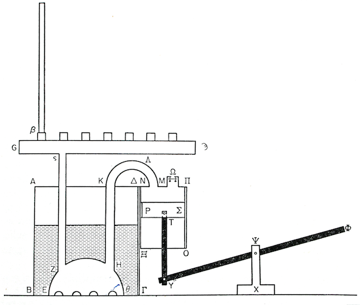
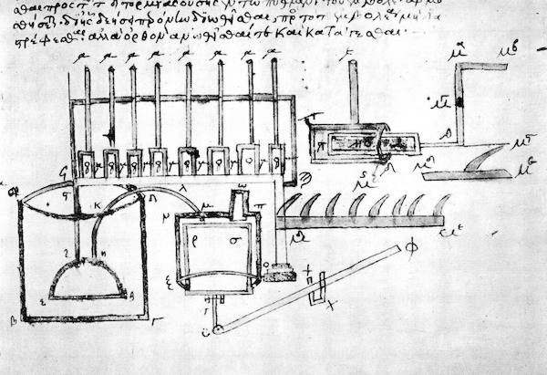
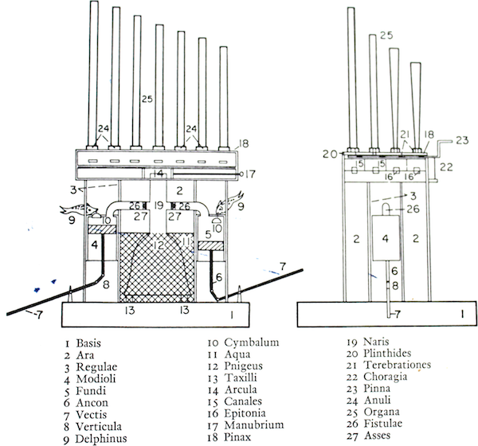
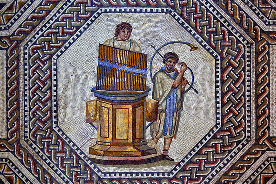
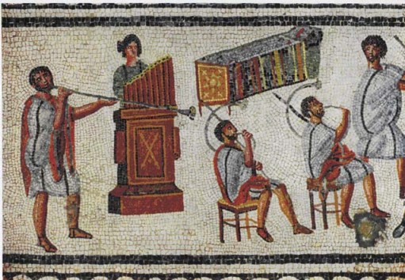

|Date      | Time   | Read               |
|----------|--------|--------------------|
|2013-10-01| ~30 mn | pp. v-xxi, pp. 3-6 |

## Introduction

- origin: far back into antiquity
- v: "The piano keyboard, for instance, derives directly from that of the Graeco-Roman organ, and the position of the
  hands on that primitive manual probably contributed in no small measure to the evolution of polyphonic music."
  #keyboard
- invented by engineer
- invention not gradual: inventor Alexandrian Greek Ktesibios
    - true creator of the instrument
    - keyboard with springs #keyboard
- "hydraulic instrument" is a confusing term
- scientific approach to historical research
- previous works
    - Hero of Alexandria
    - Vitruvius (De Architectura)
    - … skipping other works …
- reconstitutions
- definitions
    - "organum" means intrument (tool)
    - terms are confusing
    - historical misconceptions
    - examples: Old Testament; St. Augustine got it; funny illumination of musician hanging an organ up a tree
    - what it is since 3rd century
        - one or more ranks of sounding pipes
        - hey wind-chest to store air
        - a mechanical blower, either a pump or a bellows
        - a keyboard to direct the air into the various pipes #keyboard
    - Instruments that are not "organs" per our definition
        - syrinx, bagpipe, Chinese sheng (no keyboard), accordion (no pipes)
        - maybe: Jewish magrephab, but fairly late instrument

## 1. The organ in the ancient world

### The invention of the organ

#### The Alexandrian background

- fruit of the Greek science in Alexandria
- Alexandria became center of learning with Ptolemy Philadelphus, 283 BC
- Museum and Great Library (up to 500,000 manuscripts later)
- who's Who of Greek science lived there
- Plato: concepts more interesting than phenomena
- Aristotle and later: more interest in observation
- 4: "Euclid's Division of the Canon" and Ptolemy's Harmonics established that the pitch of a note is a function of the number of the oscillations made by the vibrating part."
- Ktesibios the engineer
- 4: "It is remarkable that experimental science, whose prospects were so bright, should have disappeared so quickly, and remained in abeyance for so long: and it is particularly surprising that the practically minded Romans did not take advantage of this new and positive aspect of scientific thought."
- influence of the Platonists

#### Who invented the organ?

- 5: "Great inventions are said never to be the work of one man, and for this reason people have refused to acknowledge that the organ might have been conceived and created by a single person. And yet the texts establish that this is indeed what happened."
- 5: "in its original form the musical part of the instrument was very small in relation to the mechanical part"
- 5: "Only one ancient text, The Learned Banquet (Deipnosophistes), offers any information relating to the invention of the organ."
    - by Athenaeus
    - "'There is nothing of value', says the introduction, 'to which the author does not make some reference in the course of the book'." :)
    - dialogue on the invention of the organ (Alcides & Uplian of Tyre)
    - hydraulis / hydraulic organ
    - text a bit uncertain, interesting nonetheless
    
---

|Date      | Time   | Read     |
|----------|--------|----------|
|2013-10-02| 37  mn | pp. 7-17 |

- Pliny the Elder mentions Ktesibios, for his theories on pneumatics and invention of hydraulic machines
- it is unlikely that Plato knew the organ
- Vitruvius (born c. 80–70 BC, died after c. 15 BC)
    - also mentions Ktesibios and accepts him as inventor
    - explains the theory of the hydraulis
- 10: "Thus the writings of the technical experts of Antiquity agree in attributing the invention of the new musical instrument to a real historical person, Ktesibios."

#### Where and when Ktesibios lived

- Ktesibios: not a common name, but it appears in a few places
- obscure origins
- native of Alexandria
- little doubt the engineer is a single person
- must have been adult around 270 BC

#### The character and reputation of Ktesibios

- Vitruvius gives an account of Ktesibios's early life
- son of a barber
- Vitruvius full of admiration
- Ktesibios describes his inventions in a book called *Commentaries* which is now lost, but was known to Vitruvius
- Ktesibios is generally praised by writers of the antiquity

---

|Date      | Time   | Read      |
|----------|--------|-----------|
|2013-10-03| 37 mn  | pp. 17-27 |

#### Philo of Byzantium and Hero of Alexandria

- Philo
    - different from Philo of Athens
    - could have been pupil of Ktesibios, but unknown fact
    - describes hydraulis as "a syrinx that is played it was the hands"
    - *Treatise on engineering*
    - Praises Ktesibios for having discovered properties of compressed air
    - 18: Philo "demonstrates the existence of air as a material substance, a bold concept for his day"
- Hero
    - source for Vitruvius
    - detailed description of the hydraulic organ
    - pneumatics, etc.
    - describes advanced appliances including with air, water but even steam
    - acknowledges Philo
    - machines are relatively small, and in the Roman Empire a manual labor was plentiful and cheap
    - famous
    - wide range of possible dates
    - he knew Latin
    - accepted view: first century A.D.
    - never mentions Ktesibios, but might be implicit (K. was the "master", but not directly)
    - "We may assume that the essence of Ktesibios's knowledge and skill is present in the work of Hero of Alexandria."

## 2. The hydraulic organ (I)

### Preliminary inventions

- Q: why would Ktesibios invent a new musical instrument?
- 23: "Music was much practiced in Alexandria"
- there were other musical automata, including by Ktesibios
- but existing wind mechanisms had disadvantages
- bellows were known for a long time
- Ktesibios had already invented a pump
- Philo: "He [Ktesibios] had proved, in the pneumatic theorems discussed above, that air is resistant, elastic, and extremely mobile."
- double-barreled fire pump "capable of raising water to a great height"
- before that, pumps made of skin bladders filled with water
- with Ktesibios's pump, the water did not go directly through the pistons, instead air in box pushed water
- with the hydraulis, the idea was that "Instead of moving the water by means of compressed air, he had the idea of compressing the air by the weight of the water."
- two conditions had to be met:
   - build sufficient pressure to crate to supply of air
   - maintain that pressure at more or less constant level
    - Ktesibios had already build a toy automaton doing that
- result is a "powerful and entirely original type of wind mechanism with which to feed a musical instrument whose sound potential might be practically unlimited"
- then idea of the wind-chest, and manual
- unclear whether in Ktesibios's time instrument went beyond prototype
- his wife said to be playing it
- but the potential realized in the Roman world
- detailed analysis of the mechanism are from Hero and Vitruvius

---

|Date      | Time   | Read      |
|----------|--------|-----------|
|2013-10-04| 36 mn  | pp. 28-37 |

### Hero's description

- his text is clear and precise
- apparent that the author is an experienced engineer
- copyists errors
- follows the description of Hero's organ's blowing mechanism
- "pnigeus" is the hemisphere at the bottom ("oven", "damper" other meanings), about 60 cm diameter
- "platysmation" inlet valve in air pump
- one big omission: the machine lacks an outlet valve
- pedestal about 1 m tall, 80 cm diameter
- piston pump
- cylinder about 50 cm, diameter 30 cm
- description of the wind-chest
- description of the keyboard #keyboard
    - drawers slide into the wind-chest under each pipe
    - cranks around the median axis, able to push the sliders in
    - horn spatulas act as springs, connected w/ gut to the sliders
- only one rank of pipes, but by the first century BC, the system of stops was invented
- conjecture that to reduce air leaks, grease or maybe thin leather might having applied
- Hero doesn't describe the compass, tuning, lips, or fitting of the pipes
    - engineer, not musician!
- Hero follow the description with the windmill activated organ, which seems impractical, and likely not from Ktesibios

### Vitruvius's description

- Architect Vitruvius
- knows more music then hero
- Devotes a whole chapter to the theory of Greek music
- long and sometimes obscured description of the hydraulic organ
- instrument is more sophisticated than that of Hero
    - two pumps
    - more efficient valves
    - improved type of wind-chest, can feed up to eight sets of pipes
    - seems like a real instruments, Ktesibios's organ appears more experimental
- Marcus Vitruvius Pollio
- has long been held that he lived around the time of Augustus
- some opinions place him centuries later
    - say his style was bad
    - but Vitruvius was an engineer
- more recent research seems to confirm the Augustus period
- 36: "Vitruvius is […] obviously describing in detail an instrument he has seen with his own eyes."

|Date      | Time   | Read      |
|----------|--------|-----------|
|2013-10-04| 30 mn  | pp. 38-47 |

- description by Vitruvius has all the important details
- blowing mechanism
    - 2 pumps, make for more even sound probably
    - "dolphins" and "cymbals" as intake valves
        - dolphin makes sense as instrument uses water
        - supposed to have taste for music
        - probably that not all instrument has dolphins
- wind-chest and manual
    - several ranks of pipes
    - probably invention of another, unknown Greek engineer
    - valves instead of modern draw-stops
    - sliders have n holes, as many as there are ranks of pipes
    - iron springs
    - 41: "The text contains no description of the manual with keys."
- 42: "From the positions shown in the illustrations, it is absolutely certain that he played with both hands, and was
  thus able to execute relatively quick passages with a wide variety of rhythms."

## 3. The Graeco-Roman Organ: the Evidence of the Texts

### To the middle of the first century A.D.

- besides Hero and Vitruvius, references to the organ are incidental
- summary
    - Ktesibios: 2nd 1/2 of 3rd century B.C.
    - wife Thaïs first organist
    - a few decades later, one generation or two at most, Philo of Byzantium
- we don't know if the instrument was cultivated right away, or if it was just a curiosity
- likely that it progressively grew
- 150 years after Ktesibios, inscription of Delphi
    - 90 B.C.
    - mentions Antipatros, hydraulis player
    - won 2-day competition
    - implies hydraulis well known
- 50 years later, Cicero
    - implies music of hydraulic organ a subtle pleasure
    - 1st piece of Latin evidence for existence of organ
- *Aetna* poem (Virgil's?)
    - reference of organ in "great theatres"
    - might imply organist was pumping himself, maybe w/ feet
    - also describes hydraulic sirens

---

|Date      | Time   | Read      |
|----------|--------|-----------|
|2013-10-07| 26 mn  | pp. 49-54 |

- starting middle of the first century A.D., hydraulic organ is a familiar instrument
- popular in Rome, theaters
- Nero amateur
- possible that the instruments was brought to Rome from Greece by Nero himself
- also possible that the organ in the amphitheater was used to provide rhythm to the gladiators

### The second century A.D.

- organ is part of life in the Roman world
- hydraulis has numerous sets of pipes timbres and notes

### The first appearance of the bellows organ

- today confusingly known as the pneumatic organ
- 51: "Who had the idea of replacing the pistons and the water cistern by simple bellows – and when was this first done?"
- no evidence that this was before the hydraulic organ
- possibility to add bellows instead of the manual pumps, in fact this existed as shown by Arab text
- but other approach is to eliminate water completely
- benefits
    - lighter, easier to move
    - can also be used in private houses
    - less expensive
    - less worries about leaks, rust, or frost
- hydraulis
    - more complex, so more likely to be discussed and praised
    - also relatively mysterious role of the water
- 52: "The interest stirred up by the hydraulis was largely due to the complexity of its mechanism and the mysterious
  role of the water, which aroused the admiration of scholars and baffled everyone else. But there was no magic about
  the pneumatic organ."
- drawbacks
    - harder to control pressure
    - therefore smaller instruments until later times
- clearly instruments by the second century
- Julius Pollus briefly describe two types of instruments, one with a smaller sound, and one was a bigger sound
- blacksmiths were already using bellows
- experiments seem to show that leaks in the wind-chest with sliders, bellows are incapable of supplying even small
  organs with enough air
- author "convinced that the Roman pneumatic organ must have had some kind of regulating device"

---

|Date      | Time   | Read      |
|----------|--------|-----------|
|2013-10-08| 38 mn  | pp. 55-66 |

### The third century A.D.

- 3 texts between the end of the second in the first half of the third century
- show that the organ was popular and very widely distributed
- 54: Athenaeus of Nauratis tells us that at that time "the inhabitants of Alexandria were proud of the fact that their
  city had been the birthplace of the organ"
- text by Porphyry of Tyre (233-303)
    - mentions how the length of the pipes of the aulos creates various intervals
    - "hydra": shortcut for hydraulis, and/or reference to the tentacled monster?
- one text from Rhodes implies liturgical role, which is exceptional for the time ("player of the water organ charged
  with awakening the God")

### The fourth century A.D.

- strange text from the beginning of the fourth century by Porfyrius Optatianus
    - laid out as musical instrument, including an organ
    - first time the term "organ" appears in the precise and limited sense of organ
    - from the fourth century on, impossible to know just by the term "organum" whether pneumatic or hydraulic instrument
    - "Placed beneath these comes a line of square-shaped keys whereby the musician's hand opens and shuts in time the
      openings for the air" #keyboard
    - "able to follow the opened keys, which ever tremble to the slightest touch" #keyboard
    - text to Constantine, Who we might conclude was able to appreciate this
- Julian the Apostate (332-63) clearly describes a pneumatic instrument
    - 59: "And a proud man with nimble fingers stands there manipulating the keys which give voice to the pipes." #keyboard
    - pneumatic, but large instrument, organist plays in a standing position
    - imply that the keys respond instantly to any pressure #keyboard
- Claudian (c. 400)
    - "Let him whose light touch draws forth mighty sounds"
    - at most about 50 pipes by then based on iconography
    - "Apparently it was the organist himself who operated the bellows handle, presumably with his feet"
    - organ used for the atmosphere of great occasions, recitals
- other text mentions a great wedding
    - mentions "wet" organ
    - surprising, this implies water, but specifically says that they are bellows
    - most likely is that it is a hybrid instrument
    - by that time, many people still regarded instrumental music as something rather degrading
    - by middle of the fourth century "organs were built on a larger scale than before"
    - unclear whether more pipes, or longer pipes with lower pitch (latter more likely)
- St. Augustine says that the term "organum" applies to all (organ) instruments
- several emperors besides Nero interested in music and the organ

### The fifth and sixth centuries A.D.

- Theodoret of Cyrrhus (387-450)
    - symbolism linking the organ was the tongue
    - at Antioch, bellows organ seems to have completely supplanted the hydraulic organ
    - bellows worked with the feet, like harmonium
- hydraulis as a mobile instrument
- not much material due to the great invasions and destructions that followed
- Theodoric the Great has some interest in the organ

---

|Date      | Time   | Read      |
|----------|--------|-----------|
|2013-10-09| 33 mn  | pp. 67-77 |

- Senator Cassiodorus (middle of 6th century)
    - mentions "wooden keys" #keyboard
    - describes organ able to produce "very loud sounds as well as soft sweet ones"
- inscription on a sarcophagus near Budapest at Aquincum
    - end of the 4th century
    - organist of Roman legion
    - he and his wife were organists
    - hypothesis: to accompany gladiators
- couple more inscriptions

## 4. The Graeco-Roman Organ: Iconographical Evidence

- texts explain how things work
- pictorial representations are important, because they show outward appearance
- about 40 illustrations of organs
- mainly the hydraulic organ, unchanged from Vitruvius to the disintegration of the Western Empire
- much less frequent bellows organs
    - had less impact on the public
- media: bas-relief on sarcophagi, funeral steles, ivory; statuettes; mosaics; gem-stones, medallions
- pumps, levers, blowers often left out
- author convinced that in some cases the organist used feets to pump the air
- archaeological relics: small organs of Pompeii, pneumatic organ of Aquincum
- we know very little about the manual, since it is nearly always out of sight in iconography #keyboard

### The organ with orchestra and human figures

#1. Nennig mosaic
    - Found in 1852
    - about 16 x 20 m
    - fits Vitruvius, two lateral pumps
    - hexagonal base
    - rectangular panels w/ moldings
    - cylinders supported by brackets
    - on top, table w/ moldings
    - this is the wind-chest with the pipes implanted
    - 27 or 28 pipes very tightly together
    - organist behind instruments, head and shoulders rising above the pipes
    - hands should have come halfway up the tallest pipe
        - but unlikely, keys would need 25 cm tall parts
        - probably due to artist doing from memory
    - instrument slightly more than 2 m tall, longest pipe 80 cm, smallest 60
    - artist careless, but fine instrument
    - played with the horn, probably for a gladiatorial combat

#2. and #3. Zliten mosaic
    - similar to Nennig instrument, but rectangular
    - 10 pipes, trebles to the player's right
    - compass implied about one octave
    - gladiator scene
    - other organ has 8 pipes
    - players are female

---

|Date      | Time   | Read      |
|----------|--------|-----------|
|2013-10-10| 32 mn  | pp. 77-88 |

#4. Alexandrian terracota
    - 77: "Oldest representation of an organ known to us"
    - pre-Christian times
    - fits descriptions of Hero and Vitruvius
    - pump is visible without handle
    - 14 pipes visible, trebles to the right
    - organist is a woman
    - seems like a caricature

#5. Via Appia graffito
    - scene from amphitheater
    - from Roman Villa
    - simple sketch
    - piston rods are shown
    - ~12 pipes
    - trebles to the left of the organist
    - probably end of second century / beginning of third

#6. Consular diptych of Verona
    - 517
    - 2 tall air pumps, child pumping on one side
    - 6 pipes open at the top
    - trebles to the right of organist
    - for emperor celebrations

#7. and #8. Constantinople Obelisk
    - 390
    - 2 organs
    - not hydraulic, fed by great bellows
    - children standing on bellows
    - 11 pipes
    - trebles to the left
    - second organ has eight pipes
    - trebles to the right (symmetry?)
    - likely that other bellows would have been used, children were only weights!

### The organ with human figures

#9. Roman terracota
    - child organ blower pumping w/ right hand
    -  7 pipes

#10. Rheims vase
    - Bbetween combatants
     - squarish water cistern
     - 1 blower may be operating 2 pumps
     - 8 pipes
     - trebles to the right of organist
     - 82: "Here again the hydraulic organ appears in a scene illustrating that stage in the combat immediately
       preceding the dispatch of the vanquished gladiator. Presumably the instrument was always heard at this somber
       moment."

#11. Copenhagen vase

#12. Sarcophagus of Arles
    - hydraulic organ w/ 2 blowers
    - 9 pipes
    - big horizontal pipes going to the cylinders
    - pumps very tall
    - adolescents pumping, seems to show that it was not great effort
    - trebles the right
    - might be reed pipes
    - organist appears playing with both hands #keyboard

#13. British museum gem
    - 2 organ blowers
    - 2 pipes going directly to the wind-chest (seems workable)
    - pumps appear to work alternately
    - 13 pipes
    - trebles to the right
    - possibly Pythagorean diatonic scale + B flats

#14. Rheinzabern vase
    - combat

#15. Aphrodisis' organ
    - 9 pipes
    - girl's right-hand appears to be resting on the keys #keyboard
    - small organ

#16. Tatarevo organ
    - gladiators
    - 2 pumps, 9 pipes, children pumping
    - rough execution

---

|Date      | Time   | Read      |
|----------|--------|-----------|
|2013-10-11| 18 mn  | pp. 89-98 |

#17-#24. Contorniate medallions
    - bronze medal of considerable size
    - no earlier than second half of 4th century
    - 12 showing an hydraulic organ

#17. Valentinian III medallion
    - round or hexagonal cistern, wider than it is deep
    - 2 pumps, 10 or 11 pipes, very tall ones, 2 children pumping
    - possibly new model of organ
    - largest known hydraulis
    - mentions organics by name, Peter

18.
    - 7 pipes
    - trebles to the right
19.
    - 8 pipes, trebles to the right
20.
    - 11 pipes, trebles to the right
21.
    - 9 or 10 pipes
24.
    - 5 pipes
    - possibly small-scale pneumatic organ, or syrinx
25.
    - possibly a small hydraulic organ with tessitura about one octave
26.
    - flue pipes, stopped
28
    - 6 or 7 pipes
    - probably small pneumatic organ

29. Lamp in the museum at Carthage
    - matches Vitruvius
    - great care
    - hexagonal cistern
    - large pumps
    - 3ranks of 18 pipes
    - 19 pipes shown in front (discrepancy)
    - flue pipes with lips
    - 3 stops: principal, octave, and perhaps fifth
    - manual #keyboard
        - has 18 oblong keys
        - relatively broad keys
        - low in relation to organist, explained if organist was created separately
    - is actually a lamp with burners
    - original instrument must have produced a warm, bright sound

30. Lamp in the Copenhagen Museum
    -
